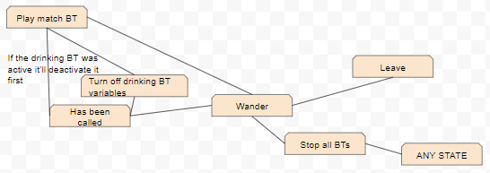
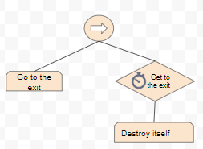
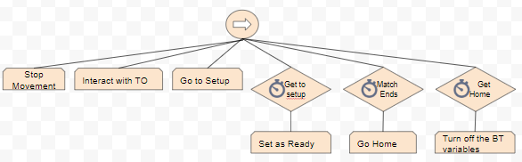
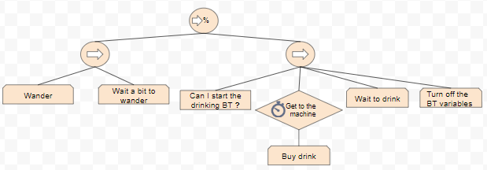
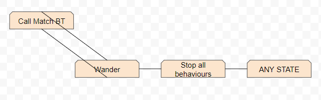

<h2>The project</h2>

This game was done as a part of the AI subject for the the UPC's Bachelor's degree, with some movement scripts given by the teachers, as well as the SimpleAssets pack for the art

The game was done in the span of 3 months between October and December, this was the order of execution:
	<ol>
		<li>The environment, making sure that the agents could more appropiately</li>
		<li>Designed and implemented the Behaviour Trees for the different agents</li>
		<li>Gameplay and balancing</li>
	</ol>

<h2>The AI</h2>

The Behaviour Trees (BTs) were done with NodeCanvas and they are the following

<h3>Participants:</h3>
<h4>FSM:</h4>

They will wander around until called and will reset to this when any behaviour ends.

<h4>Behaviour trees:</h4>

Leaving BT:

This is a very simple BT, this will just take the participant to the entrance and delete him.

Play Match BT

This will take the player to the setup, then make him wait for the other player to be ready. After that he will go tell the TO the result if he won, then go home and go back to wandering

Wander BT

Organizers:

FSM:

Similarly to the Participant he will wander until he is assigned a match to call, and is able to cut the tree in the middle of the execution if there was need of it, because of a participant leaving mid BT for example.

Call Player BT

This BT will take the TO to the different players he was assigned, calling them 1 by 1 and telling them the setup they are supposed to play in, after that he will go to his homeplace to wander on his area

Technicians: They'll make sure to install everything you buy and fix any setup or vending machine that breaks down as soon as possible!

Behaviour tree:

This behaviour tree will keep the Technic wander in their area until he is assigned a task, in which case he will leave that node of the BT and start his subtree to do what he was order
That tree starts by getting his task details (he doesn't go nowhere he just gets them by the game controller), then he goes to where he is needed, using a switch on the BT (I didn't put it in this scheme since it'd have taken too much space for something that is not much important to know exactly to get an idea of the BT). After that he will go back home and start wandering again

