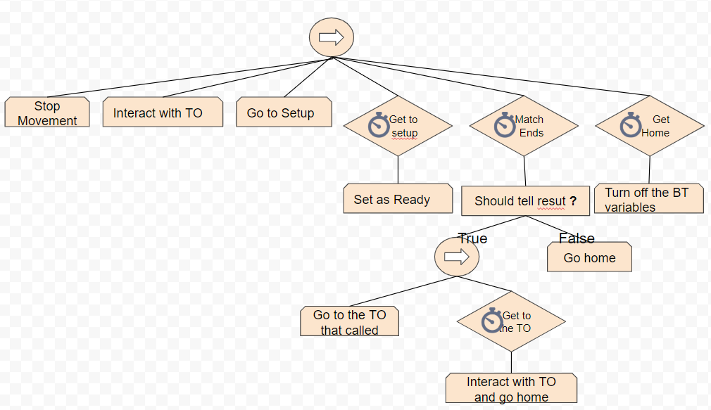

<html>
<h2>The project</h2>
	

	This game was done as a part of the AI subject for the the UPC's Bachelor's degree, with some movement scripts given by the teachers, as well as the SimpleAssets pack for the art
	

	

	The game was done in the span of 3 months between October and December, this was the order of execution:
		<ol>
			<li>The environment, making sure that the agents could more appropiately</li>
			<li>Designed and implemented the Behaviour Trees for the different agents</li>
			<li>Gameplay and balancing</li>
		</ol>
	

<h2>The AI</h2>
	

	The Behaviour Trees (BTs) were done with NodeCanvas and they are the following
	

	<h3>Participants:</h3>
		<h4>FSM:</h4>
			
			

			They will wander around until called and will reset to this when any behaviour ends.
			

		<h4>Behaviour trees:</h4>
			
<b>Leaving BT:</b>

				
				

				This is a very simple BT, this will just take the participant to the entrance and delete him.
				

			
<b>Play Match BT:</b>

				
				

				This will take the player to the setup, then make him wait for the other player to be ready. After that he will go tell the TO the result if he won, then go home and go back to wandering.
				

			
<b>Wander BT</b>

					
				

				This will make him wander around and sometimes grab a drink.
				

	<h3>Organizers:</h3>
		<h4>FSM:</h4>
			
			

			This will just make him wander until he has to call a match.
			

		<h4>Behaviour trees:</h4>
			
<b>Call players to match BT:</b>

				
				

				This BT will take the TO to the different players he was assigned, calling them 1 by 1 and telling them the setup they are supposed to play in, after that he will go to his homeplace to wander on his area
				

	<h3>Technicians</h3>
		<h4>Behaviour Trees:</h4>
			

			Contrary to the Organizers and Participants the Technicians are simple enough to be able to work on a couple of BT, here is the main BT that he uses:
			

			
			

			He'll wander until he has a task assigned or he goes to check the trash
			

			
			

			This will make him go to the task object and do the appropiate task
			

			
			

			This will make him go to the trash, pick it up, then go to the container to throw it before going home
			

</html>