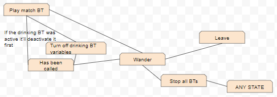

<html>
<head>
<link rel="shortcut icon" type="image/x-icon" href="{{"/favicon.ico" | prepend: site.baseurl }}">
</head>
<body>
  <h1>Can you manage this event?</h1>
  	
    

	The success of the event is in your hands! Do you think you can make this event memorable to as much people as possible?
	

    

	There's been a lack of good managing in the business, you can be the new blood that this kind of events need to be run smoothly!
	

	
	

	Manage the most important event to date!
	

	<ul>
		<li>Buy more consoles for more matches</li>
		<li>Contract more Organizers to help</li>
		<li>Watch all the clients unique names and statistics</li>
	</ul>
</body>
</html>
